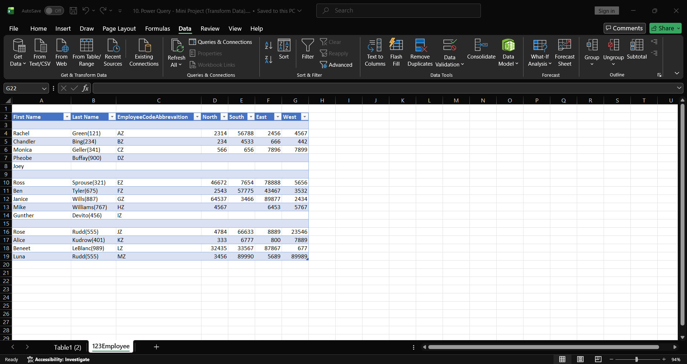
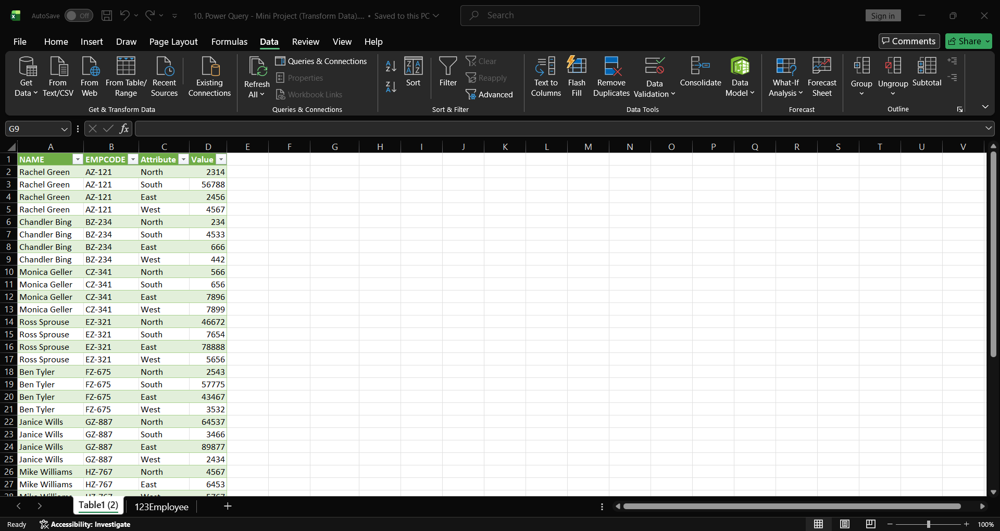

# Power Query: Cleaning & Reshaping Messy Sales Data

A mini data-cleaning project using **Microsoft Excel Power Query** to transform a messy, manually-entered employee sales dataset into a clean, analysis-ready table.

## 🎯 Problem

The raw dataset (`raw_data.xlsx`) had several common real-world data quality issues:
- First and last names split across columns, with employee codes glued onto the last name (e.g. `Green(121)`)
- Regional sales figures (North, South, East, West) spread across separate columns instead of rows
- Random blank rows breaking the table structure
- Inconsistent, non-standard layout that couldn't be used directly for analysis or visualization

## ✅ Solution

Using Power Query in Excel, I built a repeatable transformation pipeline to fix all of the above:

| Step | Transformation Applied |
|------|------------------------|
| 1 | Removed blank/null rows |
| 2 | Split the combined "Last Name(Code)" column into separate `Last Name` and `EmployeeCode` fields |
| 3 | Merged `First Name` + `Last Name` into a single clean `NAME` column |
| 4 | **Unpivoted** the North/South/East/West sales columns into two columns — `Attribute` (region) and `Value` (sales figure) — converting the table from wide format to long (tidy) format |
| 5 | Standardized data types (text vs. numeric) for each column |

## 📊 Before vs After

**Before:** Inconsistent wide-format sheet, names split and merged with codes, blank rows, regional sales values scattered across columns.

**After:** A clean 4-column table — `NAME | EMPCODE | Attribute | Value` — ready to be loaded straight into a pivot table, dashboard, or any BI tool (Power BI, Tableau) without further manual cleanup.

## 🛠️ Tools Used
- Microsoft Excel — Power Query Editor
- Techniques: Unpivot Columns, Split Column by Delimiter, Merge Columns, Remove Blank Rows, Data Type Transformation

## 💡 Why This Matters

Unpivoting wide data into tidy long-format data is one of the most common real-world data prep tasks — it's the difference between a spreadsheet a human can read and a dataset a tool (Power BI, SQL, Python/pandas) can actually consume. This project demonstrates that transformation end-to-end using a no-code ETL tool.

## 📁 Files
- `raw_data.xlsx` — original messy dataset
- `cleaned_data.xlsx` — final transformed output
- `1_raw_data.png`, `2_power_query_steps.png`, `3_final_output.png` — visual walkthrough of the transformation

---
*Part of my Data Analyst portfolio — see my other projects: [SQL 50 LeetCode Solutions](https://github.com/ANUSHKA13102003/sql-50-leetcode)*
