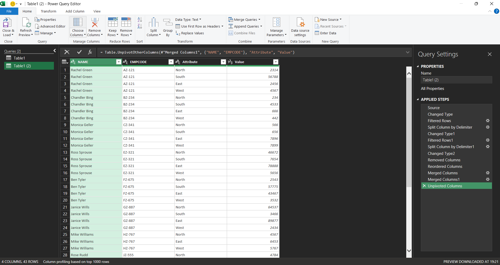

  

# Power Query — Sales Data Cleaning & Transformation

Cleaned a messy, manually-entered employee sales dataset into an analytics-ready table using Microsoft Excel Power Query. This is a repeatable, no-code ETL pipeline that turns inconsistent worksheets into production-grade data.

**Why recruiters should care:** this project demonstrates real-world data-prep skills used in analytics and BI roles — handling dirty inputs, parsing mixed fields, reshaping wide data to tidy long format, and building auditable transformations.

---

## Quick Highlights

- **Problem:** Employee names and codes combined, regional sales spread across columns, and random blank rows broke the table structure.
- **Solution:** A 5-step Power Query pipeline that splits, parses, cleans, and unpivots the data to produce a four-column tidy table: `NAME | EMPCODE | ATTRIBUTE | VALUE`.
- **Outcome:** A reusable transformation that eliminates manual cleanup and makes the data dashboard-ready with a single Refresh.

---

## Demo (Before → After)

---

## What I did (concise)

1. Removed blank and malformed rows to restore table structure.
2. Parsed `LastName(Code)` into separate `Last Name` and `EmployeeCode` fields using delimiter-based splitting and text extraction.
3. Merged `First Name` + `Last Name` into a single `NAME` column for a stable identifier.
4. Unpivoted regional columns (North/South/East/West) into `Attribute` and `Value` to convert wide → long format.
5. Standardized data types (text for names/codes, numeric for sales) and validated totals to ensure accuracy.

These steps are implemented entirely inside Power Query's Applied Steps — non-destructive and refreshable. See `APPLIED_STEPS.md` for the full Applied Steps and the Power Query M code.

---

## Files in this project

- `APPLIED_STEPS.md` — full Applied Steps and the exported Power Query M script
- `sample_raw_data.csv` — a small messy sample you can open and test in Excel
- `assets/refresh_demo.svg` — a tiny animated demo showing Open → Refresh → Done in the viewer
- `SCREENSHOTS/` — before/after screenshots of raw data, applied steps, and final output
- `PROJECT_ONE_PAGER.md` — a printable one-page summary you can attach to applications
- `TALKING_POINTS.md` — short bullets to rehearse for interviews
- `LICENSE` — MIT license

---

## How to reproduce / use (open & refresh)

1. Open `sample_raw_data.csv` or `raw_data.xlsx` in Microsoft Excel (Desktop) with Power Query (Get & Transform Data).
2. Go to **Data → Get Data → From File → From Workbook / From Text/CSV** and point to the sample file.
3. In Power Query Editor, inspect the query's Applied Steps (open `APPLIED_STEPS.md` to see the exact M code used).
4. Click **Close & Load → Refresh** to run the transformation on new data — no manual edits required.

**Tip:** Keep the original `raw_data.xlsx` structure consistent (same column headers) so the query steps apply correctly on refresh.

---

## Skills & Tools demonstrated

- **Data cleaning & wrangling**
- **Excel Power Query:** parsing, splitting, merging columns, unpivoting, and type enforcement
- **Building repeatable, auditable ETL pipelines** for BI consumption

**Tools:** Microsoft Excel (Power Query / Get & Transform)

---

## Notes for interviewers

- I can walk through the Applied Steps and explain each transformation, trade-offs, and how to adapt the query when new data quirks appear.
- I can demonstrate live during an interview or share a short recorded walkthrough.

---

## See also

Explore more of my projects:

- **[SQL Projects](https://github.com/ANUSHKA13102003?tab=repositories&q=sql)** — Database queries, optimization, and complex transformations
- **[LeetCode Solutions](https://github.com/ANUSHKA13102003?tab=repositories&q=leetcode)** — Algorithm practice and problem-solving
- **[My GitHub](https://github.com/ANUSHKA13102003)** — View all repositories and pinned projects

---

## One-pager & Talking points

See `PROJECT_ONE_PAGER.md` and `TALKING_POINTS.md` for a printable one-pager and a 60-second verbal summary you can use in interviews.

---

## License & Contact

MIT License — see `LICENSE` file.

**Contact:** [@ANUSHKA13102003](https://github.com/ANUSHKA13102003) on GitHub
